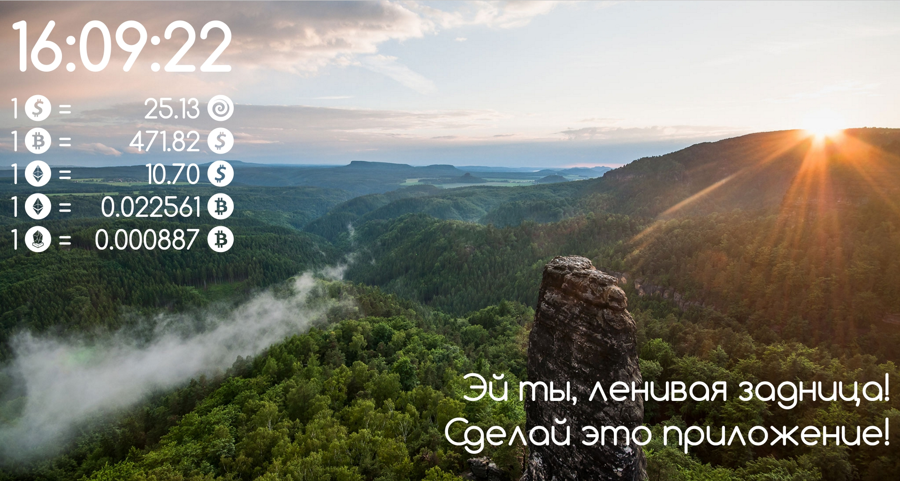

  
# ChromeTab



# Run project

In console:
```{r, engine='bash', count_lines}
npm i 
```

# For compile scss to css

run watch process for compile scss:
```{r, engine='bash', count_lines}
gulp
```

# For compile JS (ReactJS)

open new console tab for watch process to js:
```{r, engine='bash', count_lines}
webpack --watch
```
