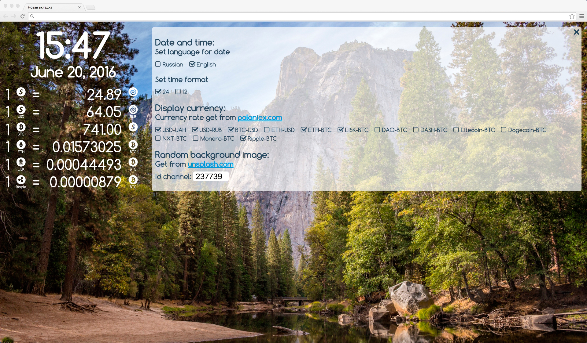

    
# Tab42

This extension is written using ReactJS and Redux.

This application has 3 main parts:
1. The date and time block.
2. Block currencies.
3. Settings.

The application includes three reducers are responsible for their units.
Actual Store stored in localstorage.
When the page loads using state of localstorage if it's there, or - the initial data.

All work with the State implemented using Redux.

This SPA display current exchange rate cryptocurrencies from poloniex.com, current time and date. For BG image use API unsplash.com



# Run project

In console:
```{r, engine='bash', count_lines}
npm i
```

# For compile JS (ReactJS) and scss to css

open new console tab for watch process to js:
```{r, engine='bash', count_lines}
webpack --watch
```
